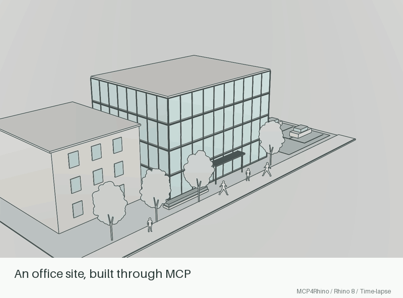

# MCP4Rhino

[github.com/isque03/mcp4rhino](https://github.com/isque03/mcp4rhino)

MCP4Rhino is a Rhino 8 plugin. It hosts a local **MCP** (Model Context Protocol) HTTP server. AI agents such as Claude Desktop and Cursor can inspect and control the active Rhino document.



A 21-second time-lapse of actual MCP-driven Rhino construction, ending with a rising fly-around. [Watch the MP4](docs/media/mcp4rhino-office-park.mp4) · [Recreate the demo](docs/README_DEMO_PLAN.md)

> If you use Claude or a similar agent with this repository, start with [`CLAUDE.md`](CLAUDE.md).

## Quick start

**Prerequisites:** [Rhino 8](https://www.rhino3d.com/), [.NET 8 SDK](https://dotnet.microsoft.com/download/dotnet/8.0), [Node.js](https://nodejs.org/) (`npx` for MCP clients).

```bash
git clone https://github.com/isque03/mcp4rhino.git
cd mcp4rhino
```

| Host | Install |
|------|---------|
| **macOS** | `bash scripts/install-yak.sh` |
| **Windows 11** | `powershell -ExecutionPolicy Bypass -File scripts/install-yak.ps1` |

Each script builds the solution, packs yak (`MCP4Rhino` **0.4.0**), and installs into the Rhino package folder. Override yak with env `YAK` if needed.

Then [start the server in Rhino](#start-in-rhino).

**Linux:** Rhino 8 has [no official Linux desktop](https://www.rhino3d.com/8/system-requirements/). Run Rhino on a Windows 11 VM/host, install with `install-yak.ps1` there, and point your Linux MCP client at `http://<windows-host>:4010/mcp`. Wine is unsupported.

## Updating from source

Already installed and pulling new commits?

1. `git pull` (or check out the release / feature branch).
2. **Tools/Logic only** (most new MCP tools, including `capture_viewport` image embed): run `scripts/hot-reload-tools.sh` (macOS) or `scripts/hot-reload-tools.ps1` (Windows), then `MCP4RhinoReload` in Rhino — no restart.
3. **Host `.rhp` / new Rhino commands / unsure:** re-run `install-yak`, **restart Rhino**, then `MCP4Rhino`.
4. Confirm with `tools/list` or a changed tool. MCP URL stays `http://127.0.0.1:4010/mcp` unless you set `MCP4RHINO_PORT`.

Agent-oriented detail: [CLAUDE.md — Upgrade from this source repo](CLAUDE.md#upgrade-from-this-source-repo-existing-install).

## Start in Rhino

After you install the package on a supported host:

1. **Restart Rhino** after install or after host `.rhp` changes.
2. Confirm a load message such as: `MCP4Rhino … loaded. Run MCP4Rhino to start…`
3. Click the **command line** above the viewports. Do not use the Help search box.
4. Run `MCP4Rhino`.
5. Confirm: `MCP server started: http://localhost:4010`.
6. Use this MCP endpoint: `http://127.0.0.1:4010/mcp`.

## Connect a client

**Claude Desktop** — merge [`examples/claude_desktop_config.json`](examples/claude_desktop_config.json):

```json
{
  "mcpServers": {
    "mcp4rhino": {
      "command": "npx",
      "args": ["mcp-remote", "http://localhost:4010/mcp"]
    }
  }
}
```

**Cursor and other clients** — connect with `npx mcp-remote http://localhost:4010/mcp`, or use the client HTTP MCP equivalent. If the client runs on Linux and Rhino runs in a Windows VM, replace `localhost` with the Windows host IP.

## Run tests

```bash
bash scripts/test-coverage.sh
```

≥80% line coverage on `MCP4Rhino.Logic` / `MCP4Rhino.Contracts`. Details: [docs/TESTING.md](docs/TESTING.md).

## Verify

With Rhino open and `MCP4Rhino` already started:

```bash
curl -sS -X POST http://127.0.0.1:4010/mcp \
  -H 'Content-Type: application/json' \
  -d '{"jsonrpc":"2.0","id":1,"method":"tools/list","params":{}}'
```

Or call `get_document_info` from your MCP client.

**Logs:** macOS `~/Library/Logs/MCP4Rhino/mcp4rhino.log` · Windows `%LOCALAPPDATA%\MCP4Rhino\mcp4rhino.log`

## Daily loop (tools only)

Rebuild Tools/Logic, copy into the installed package, then hot-reload (no Rhino restart):

| Host | Command |
|------|---------|
| **macOS** | `bash scripts/hot-reload-tools.sh` |
| **Windows** | `powershell -ExecutionPolicy Bypass -File scripts/hot-reload-tools.ps1` |

Then in Rhino: `MCP4RhinoReload` (or MCP tool `mcp4rhino_reload`). After host `.rhp` changes, restart Rhino and run `MCP4Rhino` again.

## Commands and environment

| Item | Meaning |
|------|---------|
| `MCP4Rhino` | Start the MCP HTTP server |
| `MCP4RhinoStop` | Stop the server |
| `MCP4RhinoReload` | Hot-reload `MCP4Rhino.Tools.dll` |
| `MCP4RHINO_PORT` | Listen port (default **4010**) |
| `MCP4RHINO_TOOLS_PATH` | Override directory containing `MCP4Rhino.Tools.dll` |

## Features

MCP4Rhino provides:

- A yak package with a host `.rhp` and hot-reloadable `MCP4Rhino.Tools.dll` (plus `MCP4Rhino.Logic.dll`)
- Curve, surface, solid, tag, group, view, and viewport-capture tools
- The `mcp4rhino_reload` tool so you can iterate without a Rhino restart
- Architecture-agent tools and skills (phases P0–P4) under [`.cursor/skills/`](.cursor/skills/) — see [docs/ARCHITECTURE_AGENT.md](docs/ARCHITECTURE_AGENT.md)

Semantic tags use `mcp4:` user-text keys on model objects.

## MCP tools

Core document and view tools:

| Tool | Description |
|------|-------------|
| `get_document_info` | Units, layers, counts, selection |
| `get_document_units` | Unit system, tolerances, and conversion factors (`model_units_per_inch`, …) |
| `convert_length` | Convert a named unit (in/ft/mm/…) into document model units |
| `measure_size` | Bounding-box size of one object in model units plus mm/in/ft/m |
| `get_objects` | List or filter objects by tag, group, layer, or name (bbox includes `size_in` / `size_ft` / `size_mm`) |
| `create_box` / `create_sphere` / `create_cylinder` | Add solids (**sizes are document model units**) |
| `delete_objects` | Delete by GUID list |
| `set_user_text` / `get_user_text` | Object key/value tags |
| `set_object_name` / `set_object_layer` | Rename or change layer |
| `list_groups` / `create_group` / `add_to_group` | Group membership |
| `list_views` | Viewports and camera summaries |
| `get_view` | Full camera state (`view` optional; default is the active view) |
| `set_active_view` | Activate a view by name (`Perspective`, `Top`, …) |
| `set_illustration_style` | Apply a pale architectural display preset with dark edges and no grid; preserves built-in display modes |
| `set_view` | Set absolute `camera` and `target` (optional `up`) |
| `orbit_view` | Relative yaw and pitch in degrees around the target |
| `pan_view` | Screen-space pan (`right` / `up` in model units) |
| `zoom_view` | Dolly toward or away from the target (`factor` > 1 zooms in) |
| `zoom_extents` | Fit all objects (optional `ids`) |
| `capture_viewport` | PNG screenshot: text metadata (`path`, sizes, `image_embedded`) plus MCP **image** when file ≤ 1 MiB and passes PNG signature check (`width`/`height`/`view`/`path`; both OS try ViewCaptureToFile first, then CaptureToBitmap on Windows) |
| `run_rhino_command` | Scripted Rhino command escape hatch |
| `mcp4rhino_reload` | Hot-reload Tools and Logic without a Rhino restart |

**Geometry P0 (curves and solids)** — also listed in [`CLAUDE.md`](CLAUDE.md):

- Create: `create_point`, `create_line`, `create_polyline`, `create_circle`, `create_arc`, `create_ellipse`, `create_polygon`, `create_rectangle`, `create_curve`
- Edit: `join_curves`, `trim_curve`, `split_curve`, `explode_objects`, `offset_curve`, `fillet_curve`, `extrude_curve`
- Other: boolean tools, `transform_objects`, layers, blocks, `set_document_units` / `get_document_units`, `convert_length`, `measure_size`

**Document units:** length coordinates on create/transform tools are in the **current document unit system** (same as Rhino). Angles, counts, and scale factors are not lengths. If the user says “32 inches” and the file is in Feet, call `convert_length` first, then create, then verify with `measure_size` or `measure_distance` (`distance_in` for point pairs). See [CHANGELOG.md](CHANGELOG.md).

**Surfaces P0** — full Rhino-command map in [`docs/ARCHITECTURE_AGENT.md`](docs/ARCHITECTURE_AGENT.md):

- Create: `create_plane_surface`, `create_srf_pt`, `create_planar_surface`, `create_edge_surface`, `loft_surface`, `sweep1_surface`, `sweep2_surface`, `revolve_surface`, `rail_revolve_surface`, `network_surface`, `patch_surface`, `pipe_surface`, `extrude_curve_along_curve`
- Edit: `fillet_surfaces`, `blend_surfaces`, `chamfer_surfaces`, `offset_surface`, `trim_surface`, `split_surface`, `join_surfaces`, `cap_planar_holes`
- Edges: `list_surface_edges`, `dup_border`, `dup_edge`, `extract_isocurve`

Later phases (see [docs/ARCHITECTURE_AGENT.md](docs/ARCHITECTURE_AGENT.md)):

| Phase | Examples |
|-------|----------|
| Architecture P1 | `create_level`, `create_wall`, `create_slab`, `create_door`, `create_window`, `create_stair`, `create_space`, `get_building_model` |
| Documentation P2 | Sections, elevations, dims, tags, sheets, schedules, `export_dwg`, `export_images` |
| Interop P3 | `check_rhino_license`, `export_3dm` (requires valid license / active eval), `export_ifc`, `clash_detect`, `quantity_takeoff`, links |
| Code P4 | `set_code_context`, `run_code_checks`, `get_code_report` (pre-check findings only) |

Project skills: [`.cursor/skills/arch-*`](.cursor/skills/).

## Troubleshooting

| Symptom | Fix |
|---------|-----|
| Nothing listens on 4010 | Run `MCP4Rhino` in the Rhino **command line** (not Help). The server does not start when the plugin loads. |
| Port bind error | Another process owns the port. Set `MCP4RHINO_PORT` and update the client URL. |
| Commands not found | Install failed, or Rhino was not restarted after yak install. Re-run `bash scripts/install-yak.sh`, then restart Rhino. |
| Tools or Logic code not updating | Copy both DLLs (`hot-reload-tools.sh` on macOS), then run `MCP4RhinoReload` / `mcp4rhino_reload`. Restart Rhino after host `.rhp` edits. |
| Object is huge vs the size the user named (e.g. “32 inches” → tens of feet) | Document is likely Feet (or another unit) while the agent passed the inch number raw. Call `get_document_units`, `convert_length`, recreate, then `measure_size`. |
| Unit change did not resize geometry | Pass `scale_existing: true` to `set_document_units` (fixed to actually scale). |
| `capture_viewport` on Mac | Scripted ViewCaptureToFile (does not pass `width`/`height` into the script). Default PNG path: `~/Library/Logs/MCP4Rhino/`. Embeds `image` when ≤ 1 MiB. |
| `capture_viewport` on Windows | ViewCaptureToFile first; CaptureToBitmap fallback uses `width`/`height`. Default PNG path: `%LOCALAPPDATA%\MCP4Rhino\`. Same embed rules. |
| `capture_viewport` has path but no image | Text may set `image_embedded: false` and `image_omitted_reason: "exceeds_max_bytes"` (plus `byte_length`, `max_embedded_png_bytes`). On Windows, retry smaller `width`/`height` (CaptureToBitmap path). On macOS, ViewCaptureToFile size is viewport-driven — open `path` if the agent can read the Rhino host disk, or capture a tighter view. Invalid/unreadable PNG fails the tool (JSON-RPC error), not omit-metadata. |
| `export_3dm` fails with a license / evaluation message | Rhino is not allowing save (`RhinoApp.CanSave` is false: expired evaluation, expired Cloud Zoo lease, or inactive shared seat). Call `check_rhino_license`; renew or activate a valid Rhino license / evaluation before saving. |

## Changelog

See [CHANGELOG.md](CHANGELOG.md).

## License

MIT — see [LICENSE](LICENSE).
